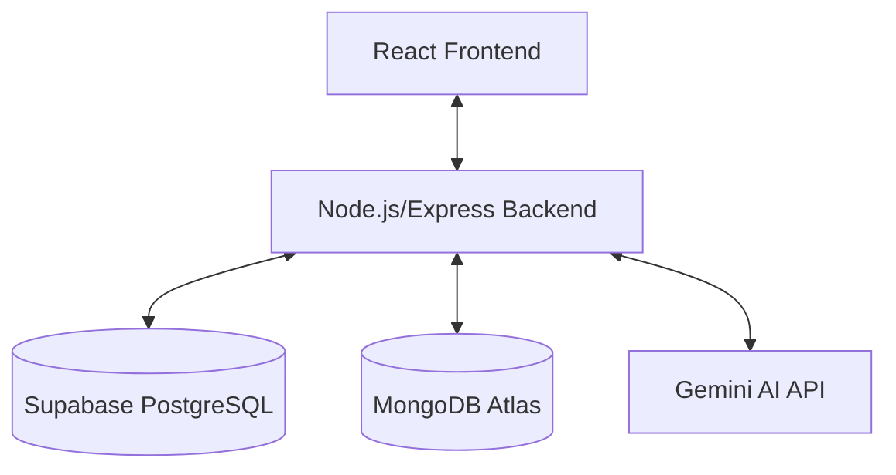

# TravelGo - Project Explanation & Technical Documentation

## 1. Project Overview

TravelGo is a comprehensive travel booking application designed to simplify the process of discovering and booking hotels. It combines a robust booking engine with AI-powered recommendations to provide a personalized travel planning experience.

### Key Capabilities
- **Hotel Booking**: User-friendly interface for searching, filtering, and booking hotels.
- **AI Recommendations**: Personalized travel suggestions powered by Google Gemini AI.
- **Secure Authentication**: Robust user management with JWT and Supabase.
- **Dynamic Pricing & Availability**: Real-time room availability and pricing checks.
- **Payment Integration**: Secure payment flow simulation.
- **User Dashboard**: Centralized view of bookings, profile, and history.

---

## 2. Technology Stack

### Frontend (Client-Side)
- **Framework**: React.js (TypeScript) for building a dynamic user interface.
- **Routing**: React Router for seamless navigation.
- **State Management**: Context API (AuthContext) for managing user sessions.
- **Styling**: CSS Modules/Custom CSS for responsive design.
- **API Client**: Fetch API for backend communication.

### Backend (Server-Side)
- **Runtime**: Node.js & Express.js for a scalable API server.
- **Authentication**: JWT (JSON Web Tokens) for secure session management.
- **AI Integration**: Google Generative AI (Gemini) SDK.
- **Database Client**: Supabase JS Client for PostgreSQL operations.

### Database & Storage
- **Primary Database**: Supabase (PostgreSQL) - Stores users, bookings, hotels, room types, reviews, and payments.
- **Recommendation Store**: MongoDB Atlas - Stores unstructured AI recommendation logs and user preferences.
- **Images**: (Optional) Cloud storage or local assets.

### DevOps & API
- **API Architecture**: RESTful API design.
- **Configuration**: Environment variables (.env) for secure credential management.

---

## 3. System Architecture

The application follows a standard **Client-Server Architecture**:



1.  **Frontend**: The React app runs in the user's browser, handling all UI interactions. It communicates with the backend via HTTP requests (GET, POST).
2.  **Backend**: The Express server acts as the central controller. It validates requests, enforces security rules (Auth Middleware), and orchestrates data fetching.
3.  **Supabase**: Acts as the primary source of truth for structured data (Users, Bookings, Hotels). It provides powerful querying capabilities and Real-time subscription potential.
4.  **MongoDB**: Used specifically for logging complex AI interactions and recommendations, allowing for flexible data structures.
5.  **Gemini AI**: External service called by the backend to generate intelligent travel content.

---

## 4. Key Features & User Flows

### A. User Authentication
1.  **Register**: User submits details -> Backend creates record in Supabase `USER` table -> Returns JWT.
2.  **Login**: User submits credentials -> Backend verifies against Supabase -> Returns JWT.
3.  **Session**: Frontend stores token in localStorage; backend validates token on protected routes.

### B. Hotel Search & Discovery
1.  User enters destination and dates.
2.  Frontend requests `/api/hotels`.
3.  Backend queries Supabase `HOTEL` table, joining `CITY`, `COUNTRY`, and `ROOM_TYPE`.
4.  Results displayed with filters for price and amenities.

### C. Booking Process
1.  **Selection**: User selects a room type.
2.  **Availability Check**: System checks `AVAILABILITY` table for the selected dates.
3.  **Reservation**: User confirms booking. Backend creates a `BOOKING` record (Status: Pending/Confirmed).
4.  **Payment**: User completes payment flow -> Booking status updated to `Confirmed`.

### D. AI Recommendations
1.  User requests recommendations for a trip style (e.g., "Relaxing beach vacation").
2.  Backend sends prompt to **Gemini AI**.
3.  Gemini returns suggested destinations and hotels.
4.  Backend stores this interaction in **MongoDB** for future reference and personalization.
5.  Frontend displays the tailored suggestions.

---

## 5. Database Schema (Supabase)

### Core Tables
-   **USER**: `UserID` (PK), `UserName`, `Email`, `Password` (Hashed), `FName`, `LName`, `Address`, `ContactNo`.
-   **HOTEL**: `HotelID` (PK), `HotelName`, `CityID` (FK), `HotelRating`, `Description`.
-   **ROOM_TYPE**: `RoomTypeID` (PK), `HotelID` (FK), `RoomTypeName`, `Price`, `Capacity`.
-   **AVAILABILITY**: `AvailabilityID` (PK), `RoomTypeID` (FK), `Date`, `NumberOfRooms`.
-   **BOOKING**: `BookingID` (PK), `UserID` (FK), `RoomTypeID` (FK), `CheckinDate`, `CheckoutDate`, `NoOfRooms`, `Confirmed`.
-   **PAYMENT**: `PaymentID` (PK), `BookingID` (FK), `Amount`, `PaymentDate`, `PaymentMethod`.
-   **REVIEW**: `ReviewID` (PK), `UserID` (FK), `HotelID` (FK), `Rating`, `Comment`.
-   **CITY/COUNTRY**: Reference tables for locations.

---

## 6. Setup & Installation

### Prerequisites
-   Node.js & npm installed.
-   Supabase account (Project URL & Keys).
-   MongoDB Atlas account (Connection String).
-   Google Gemini API Key.

### API Keys Setup (`.env`)
Create a `.env` file in `backend/` and `my_react_app/` with:
-   `PORT`
-   `MONGODB_URI`
-   `SUPABASE_URL` & `SUPABASE_SERVICE_ROLE_KEY` (Backend) / `ANON_KEY` (Frontend)
-   `GEMINI_API_KEY`
-   `JWT_SECRET`

### Usage Instructions

1.  **Start Backend**:
    ```bash
    cd backend
    npm install
    npm run dev
    ```
    Server runs on `http://localhost:5001`.

2.  **Start Frontend**:
    ```bash
    cd my_react_app
    npm install
    npm start
    ```
    App opens at `http://localhost:3000`.

3.  **Access App**: Open browser to `http://localhost:3000`.

---

## 7. Future Enhancements
-   **Real-time Notifications**: Implement WebSockets/Supabase Realtime for instant booking updates.
-   **Advanced AI**: Chatbot interface for interactive travel planning.
-   **Mobile App**: React Native version for mobile users.
-   **Admin Dashboard**: Dedicated portal for hotel managers to update availability.
