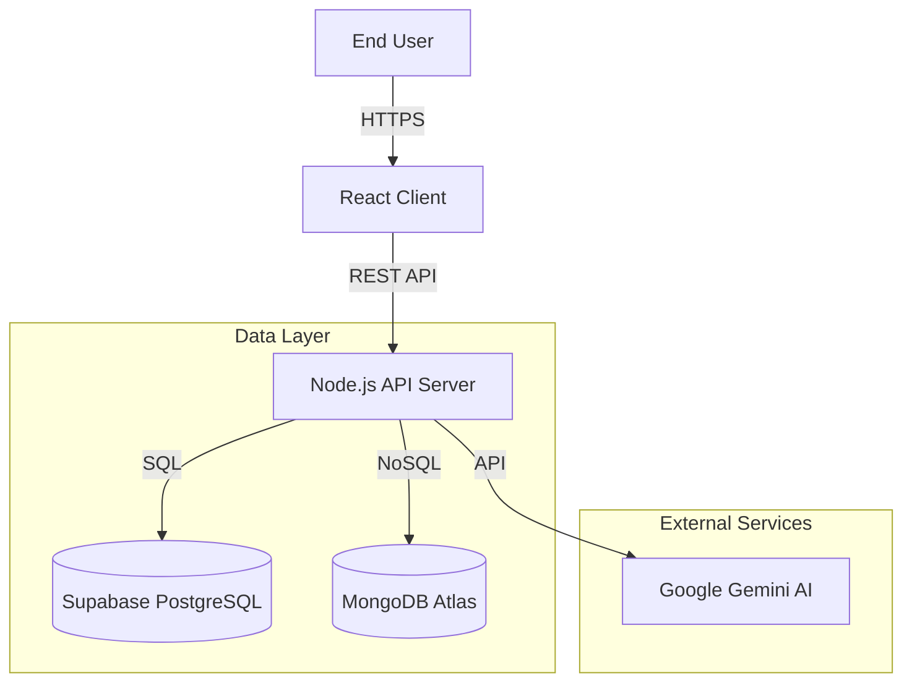

# TravelGo - Technical Project Documentation
**Version:** 1.0.0  
**Date:** January 24, 2026  
**Author:** Tharun Gowda  

---

## 1. Executive Summary

**TravelGo** is a full-stack web application designed to revolutionize the hotel booking experience. By integrating traditional booking capabilities with Generative AI, it allows users to find personalized travel destinations and accommodations based on natural language queries.

The system is built on a **modern Microservices-ready architecture**, utilizing **React** for the frontend, **Node.js/Express** for the backend API, **Supabase (PostgreSQL)** for relational data, and **MongoDB** for unstructured AI logs.

---

## 2. System Architecture

The application follows a modular Client-Server architecture designed for scalability and maintainability.

### 2.1 High-Level Architecture



### 2.2 Component Interaction

1.  **Frontend (UI)**: Handles user input, state management (AuthContext), and visual rendering. It uses `fetch` to communicate with the backend.
2.  **Authentication**: Uses **JWT (JSON Web Tokens)**. Tokens are issued by the backend upon login and stored in `localStorage`.
3.  **Backend (API)**: Validates requests, interacts with databases, and processes business logic.
4.  **AI Engine**: Receives natural language prompts (e.g., "Honeymoon in Paris"), generates structured JSON suggestions using Gemini 2.5 Flash, and returns them to the user.

---

## 3. Database Schema Design

The system uses a **Hybrid Database Approach**: Supabase for core transactional data and MongoDB for AI history.

### 3.1 Relational Schema (Supabase PostgreSQL)

#### **USER Table**
| Field | Type | Description |
|-------|------|-------------|
| `UserID` | UUID (PK) | Unique identifier |
| `UserName` | VARCHAR | Unique login name |
| `Email` | VARCHAR | User email |
| `Password` | VARCHAR | Hashed password (Bcrypt) |
| `FName` | VARCHAR | First Name |
| `LName` | VARCHAR | Last Name |
| `Role` | VARCHAR | User/Admin |

#### **HOTEL Table**
| Field | Type | Description |
|-------|------|-------------|
| `HotelID` | INT (PK) | Unique identifier |
| `HotelName` | VARCHAR | Name of the property |
| `CityID` | INT (FK) | Reference to City |
| `HotelRating` | DECIMAL | 1-5 Star rating |
| `Description` | TEXT | Property details |

#### **BOOKING Table**
| Field | Type | Description |
|-------|------|-------------|
| `BookingID` | INT (PK) | Unique identifier |
| `UserID` | UUID (FK) | Who made the booking |
| `RoomTypeID` | INT (FK) | Room configuration |
| `CheckinDate` | DATE | Start date |
| `CheckoutDate` | DATE | End date |
| `Confirmed` | BOOLEAN | Payment status |

#### **Other Tables**
-   `ROOM_TYPE`: Defines pricing and capacity per hotel.
-   `AVAILABILITY`: Tracks daily room inventory.
-   `PAYMENT`: Records transaction details.
-   `REVIEW`: Stores user feedback.

### 3.2 NoSQL Schema (MongoDB Atlas)

#### **AI_RECOMMENDATIONS Collection**
Used to store the history of AI interactions for personalization.
```json
{
  "_id": "ObjectId",
  "userId": "UUID",
  "prompt": "String",
  "suggestions": [
     {
       "city": "Paris",
       "hotelName": "Grand Hotel",
       "reason": "Matches romantic preference"
     }
  ],
  "timestamp": "Date"
}
```

---

## 4. API Documentation

### 4.1 Authentication Endpoints

#### `POST /api/auth/register`
Creates a new user account.
-   **Payload**: `UserName`, `Password`, `Email`, `FName`, `LName`...
-   **Response**: `{ success: true, token: "jwt...", user: {...} }`

#### `POST /api/auth/login`
Authenticates existing user.
-   **Payload**: `UserName`, `Password`
-   **Response**: `{ success: true, token: "jwt..." }`

### 4.2 Booking Endpoints

#### `POST /api/bookings`
Creates a new pending reservation.
-   **Headers**: `Authorization: Bearer <token>`
-   **Payload**: `RoomTypeID`, `CheckinDate`, `CheckoutDate`, `NoOfRooms`
-   **Logic**: Checks `AVAILABILITY` table -> Inserts into `BOOKING` -> Returns `BookingID`.

#### `POST /api/bookings/:id/confirm`
Finalizes a booking after payment.
-   **Updates**: Sets `Confirmed = true`.

### 4.3 AI Endpoints

#### `POST /api/ai/recommendations`
Generates travel ideas.
-   **Payload**: `prompt` (e.g., "Cheap trip to beach")
-   **Process**: Calls Gemini API -> Formats JSON -> Save to MongoDB -> Return to Client.

---

## 5. Security Implementation

1.  **Transport Security**: All API communication should be over HTTPS (in production).
2.  **Authentication**: Stateless JWT Authentication.
    -   Token contains `userId` and `role`.
    -   Tokens signed with `JWT_SECRET`.
3.  **Password Storage**: Passwords are never stored in plain text. We use **Bcrypt** for hashing.
4.  **Database Security**:
    -   Supabase uses **Row Level Security (RLS)** policies (configurable).
    -   Service Role Key used only on server-side.
5.  **Input Validation**: API validates all incoming payloads to prevent Injection attacks.

---

## 6. Frontend Architecture (React)

### 6.1 Key Components
-   `AuthContext.tsx`: Global state provider for user user/token.
-   `databaseService.ts`: Centralized service for Supabase interactions.
-   `api.ts`: Configured Axios/Fetch client for backend API.
-   **Pages**:
    -   `Home`: Landing page + Search.
    -   `Hotel`: Hotel details + Room selection.
    -   `Booking`: Checkout form.
    -   `Payment`: Payment gateway simulation.

### 6.2 State Management
-   Uses React `Context` for global Auth state.
-   Uses `useState` / `useEffect` for local component data fetching.

---

## 7. Setup & Run Guide

### 7.1 Backend Setup
```bash
cd backend
npm install
# Configure .env with Database and API Keys
npm run dev
```

### 7.2 Frontend Setup
```bash
cd my_react_app
npm install
# Configure .env
npm start
```

### 7.3 Testing
-   Run connection tests: `node backend/scripts/testAllConnections.js`
-   Access App: `http://localhost:3000`

---

## 8. Export Instructions

To save this document as a **PDF**:
1.  Open this file in a Markdown Viewer (e.g., VS Code Preview).
2.  Right-click -> **Print** (or `Cmd+P` / `Ctrl+P`).
3.  Select Destination: **Save as PDF**.
4.  Click **Save**.

To save as **Word/Docs**:
1.  Copy the content.
2.  Paste into Google Docs or Microsoft Word.
3.  Markdown formatting usually preserves, or use a "Paste as Markdown" plugin.
