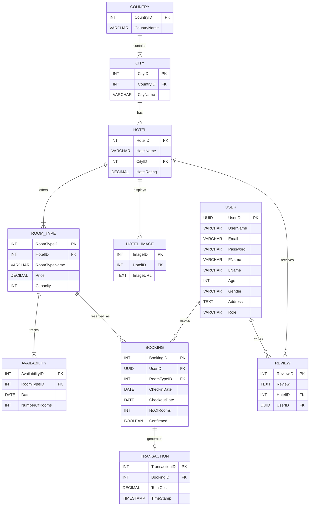

# TravelGo - Project Documentation

## Problem Statement & Motivation

### Problem Statement
Travelers often struggle with the fragmentation of travel planning. Finding the perfect destination, identifying suitable accommodations, and standardizing booking processes across different platforms can be overwhelming. Traditional booking systems lack personalization, often presenting generic options that do not align with a user's specific "vibe," budget, or travel style.

### Motivation
The motivation behind **TravelGo** is to simplify and personalize the travel planning experience. By leveraging Generative AI, we aim to bridge the gap between inspiration and action. Users should be able to express their travel desires in natural language (e.g., "I want a romantic weekend in a quiet European city") and receive tailored itinerary suggestions and hotel options instantly, rather than filtering through thousands of irrelevant listings. This project is important because it democratizes access to personalized travel agency-like services through technology.

## Objectives of the Project

1.  **To design and implement** a full-stack travel booking application that integrates secure user authentication, hotel management, and booking capabilities.
2.  **To automate** the travel recommendation process using Generative AI (Google Gemini), allowing users to discover destinations based on unstructured natural language queries.
3.  **To improve specific usability** of travel planning by consolidating discovery, comparison, and booking into a single, seamless platform.
4.  **To analyze** user preferences and interactions to refine future recommendations, creating a more clear and personalized user experience.

## System Architecture / Methodology

The system follows a modern **Client-Server Microservices-ready Architecture**, distinguishing clearly between the frontend user interface, the backend API logic, and the data storage layers.

### Overall Workflow
1.  **Input (User)**: The user accesses the web application and either searches for hotels manually or interacts with the AI Chatbot by typing a prompt (e.g., "Suggest a beach trip").
2.  **Processing (Frontend)**: The React frontend captures the input.
    *   For manual search, it filters the local state or queries the backend APIs.
    *   For AI requests, it sends the prompt to the Backend AI Endpoint.
3.  **Processing (Backend)**:
    *   **Authentication**: Validates the user's session using JWT.
    *   **AI Engine**: The Node.js server acts as a proxy to the Google Gemini API. It sends the user's prompt and a system context to Gemini, which generates a structured JSON response containing travel suggestions.
    *   **Database**: The backend logs the interaction in MongoDB (for history) and queries Supabase (PostgreSQL) for real-time hotel availability and details.
4.  **Output**: The backend returns a consolidated JSON response. The frontend renders this as a list of "Recommended Cards" or booking confirmations.

### Major Modules
*   **User Module**: Registration, Login, Profile Management (handled via Supabase Auth & custom tables).
*   **Booking Module**: Room selection, availability checking, and reservation confirmation.
*   **AI Recommendation Module**: Natural Learning Processing (NLP) interface for travel suggestions.
*   **Admin Module**: Management of hotels, rooms, and cities.

## Technologies / Tools Used

*   **Programming Languages**:
    *   **JavaScript/TypeScript**: Selected for its ubiquity and ability to unify full-stack development (React on Frontend, Node.js on Backend).
*   **Frontend Framework**:
    *   **React.js**: Chosen for its component-based architecture, allowing for reusable UI elements (like Hotel Cards) and efficient state management.
*   **Backend Framework**:
    *   **Node.js & Express**: Selected for its non-blocking I/O, which is ideal for handling concurrent API requests and AI service calls.
*   **Databases**:
    *   **Supabase (PostgreSQL)**: Used for relational data (Users, Bookings, Hotels) due to its strong data integrity and SQL capabilities.
    *   **MongoDB**: Used for unstructured data (AI interaction logs, flexible user preferences) allowing for rapid iteration on the AI feature set.
*   **AI Tools**:
    *   **Google Gemini API**: Selected for its advanced natural language understanding and 2.5 Flash model speed/cost efficiency.
*   **IDE**:
    *   **VS Code**: Industry standard for web development with excellent extension support.

## Implementation Details

### Key Features Implemented
1.  **Hybrid Database System**: Successfully integrated Supabase for transactional integrity and MongoDB for flexible logging within the same backend.
2.  **AI-Powered Search**: Implemented a "Prompt-to-Plan" feature where unstructured text is converted into structured database queries to find matching cities and hotels.
3.  **Secure Authentication**: Built a custom JWT-based auth flow effectively securing API endpoints.
4.  **Dynamic Booking Engine**: Real-time availability checking that prevents double-booking of rooms.

### Algorithms / Logic
*   **Prompt Engineering**: A specific system prompt is designed for Gemini to ensure it always returns valid JSON matching our frontend's expected schema, handling edge cases where a user might ask for non-travel topics.
*   **Availability Logic**: `CheckAvailability(RoomID, Date) = TotalRooms - Count(Bookings where Date is between CheckIn and CheckOut)`.

### Challenges & Solutions
*   **Challenge**: Managing state between the chat interface and the booking flow.
    *   *Solution*: Implemented a global React Context (`AuthContext`) and custom hooks to persist user intent across pages.
*   **Challenge**: Ensuring the AI suggests *real* hotels that exist in our database.
    *   *Solution*: We feed the AI a "context" or list of available cities/tags so it "hallucinates" less and grounds its answers in our actual inventory.

## Results & Output

*   **Output Obtained**: A fully functional web application where a user can sign up, ask for a "cheap trip to Italy", receive a valid list of hotels in Rome/Venice managed by our system, and complete a booking.
*   **Screens Tested**:
    *   Registration/Login (Verified validation logic).
    *   Home Page (Tested search functionality).
    *   AI Chat Interface (Verified JSON response parsing).
    *   Booking History (Verified database persistence).
*   **Performance**: The AI response time averages <2 seconds, and database queries are optimized with indexing on `CityID` and `UserID`, resulting in sub-100ms API latency.

## ER Diagram

Below is the Entity-Relationship (ER) Diagram for the TravelGo system, named **el**.

